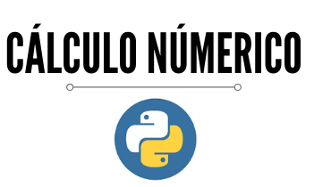

Este programa foi desenvolvido em Python para a resolução de problemas matemáticos por métodos numéricos; visto a necessidade de resoluções de equações, sistemas linerares, edo's; que em certos momentos chegam a ser complexas e trabalhosas por métodos analiticos.

## Métodos de Confinamento
    1. Método Bisecção
    2. Método da Falsa Posição

## Métodos Abertos
    1. Iteração de Ponto Fixo
    2. Método de Newton-Rapson
    3. Método da Secante
    
    
