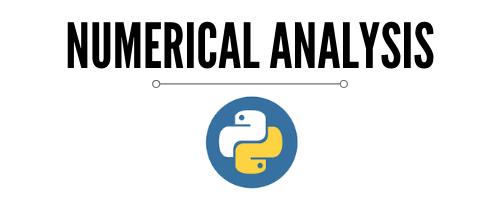

Those algorithm was coded in Python Programming Language looking for solving mathematical problems by Numerical Analysis. Despite the need to solve complex equation as linear system, differantial equation, etc, here we focous only in the algorithm. Here isn't the place you are going to find solution for problems with these algorithm directly applyed.

## Containment Methods
    1. Bissection 
    2. False-Position

## Open Methods
    1. Fixed-Point
    2. Método de Newton-Rapson
    3. Método da Secante
    
    
